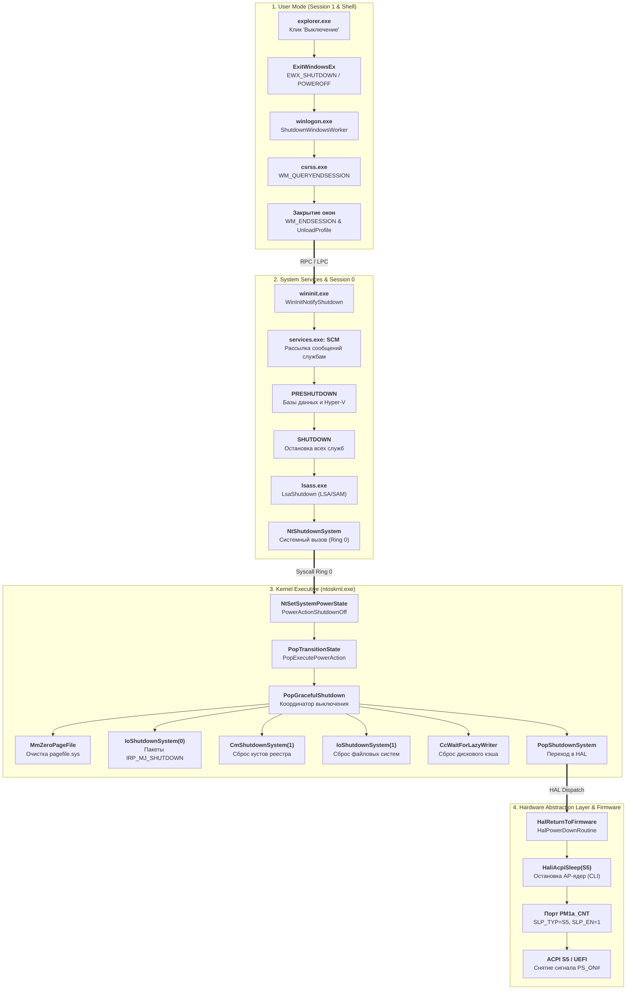

# 1. Полное завершение работы (Shutdown S5 & Reboot)

Стек полного выключения Windows NT охватывает сквозной конвейер: от клика пользователя в меню «Пуск» оболочки `explorer.exe` через закрытие приложений сессии, выгрузку служб SCM, флашинг дисковых кэшей и кустов реестра до аппаратного обесточивания через ACPI / UEFI.

---

## 1.1 Полный архитектурный конвейер вызовов



---

## 1.2 Инициация в пользовательском режиме (`explorer.exe`)

Когда пользователь нажимает кнопку выключения:
1. Оболочка `explorer.exe` вызывает API-функцию `ExitWindowsEx(EWX_SHUTDOWN | EWX_POWEROFF, SHTDN_REASON_FLAG_PLANNED)`.
2. Функция формирует LPC/ALPC-запрос к подсистеме `csrss.exe` и RPC-вызов диспетчеру `winlogon.exe`.

---

## 1.3 Завершение пользовательской сессии (`winlogon.exe` и `csrss.exe`)

1. **Опрос приложений (`WM_QUERYENDSESSION`)**:
   `csrss.exe` обходит список GUI-потоков в интерактивной сессии и отправляет сообщение `WM_QUERYENDSESSION`. Если приложение возвращает `FALSE` и не зависло, `LogonUI.exe` отображает экран предупреждения с предложением принудительно закрыть программы.
2. **Закрытие приложений (`WM_ENDSESSION`)**:
   При подтверждении приложения получают `WM_ENDSESSION`, сохраняют несохраненные данные и завершаются через `ExitProcess(0)`.
3. **Принудительное завершение**:
   По истечении таймаута `WaitToKillAppTimeout` оставшиеся неотвечающие процессы завершаются ядром через `NtTerminateProcess`.
4. **Выгрузка профиля пользователя**:
   `winlogon.exe` вызывает `UnloadUserProfile`, фиксирует куст `NTUSER.DAT` в реестре, закрывает оконную станцию `WinSta0` и переходит к завершению Session 0.

---

## 1.4 Остановка служб и Session 0 (`wininit.exe` и `services.exe`)

1. `wininit.exe` вызывает `WinInitNotifyShutdown`, уведомляя диспетчер служб Service Control Manager (`services.exe`).
2. **Фаза Preshutdown (`SERVICE_CONTROL_PRESHUTDOWN`)**:
   Службы, зарегистрировавшие расширенный контроль (базы данных SQL Server, службы Hyper-V, антивирусы), получают уведомление `SERVICE_CONTROL_PRESHUTDOWN`. Диспетчер ожидает их завершения в порядке, заданном параметром реестра `PreshutdownOrder`, выделяя до нескольких минут (`PreshutdownTimeout`).
3. **Фаза Shutdown (`SERVICE_CONTROL_SHUTDOWN`)**:
   Всем остальным активным службам параллельно отправляется `SERVICE_CONTROL_SHUTDOWN`.
4. **Остановка подсистемы безопасности**:
   `wininit.exe` инициирует закрытие подсистемы `lsass.exe: LsaShutdown` (выгрузка пакетов аутентификации Kerberos и NTLM) и вызывает системный вызов `NtShutdownSystem(ShutdownPowerOff)`.

---

## 1.5 Ядро и файловые системы (`ntoskrnl.exe`)

### 1. Главный координатор выключения ядра: `PopGracefulShutdown`

<FunctionCard 
  name="PopGracefulShutdown"
  module="ntoskrnl.exe"
  :exported="false"
  prototype="void __noreturn PopGracefulShutdown(void)"
  irql="PASSIVE_LEVEL (0)"
  caller="ntoskrnl.exe: PopExecutePowerAction"
  phase="Kernel Shutdown Orchestration"
>
Выполняет упорядоченную остановку всех исполнительных подсистем ядра: очищает файл подкачки, рассылает пакеты IRP_MJ_SHUTDOWN драйверам, сбрасывает кэш Cache Manager, фиксирует кусты реестра и закрывает файловые системы NTFS/ReFS перед передачей управления в HAL.
</FunctionCard>

<DecompiledCode 
  name="PopGracefulShutdown"
  module="ntoskrnl.exe"
  callingConvention="__noreturn"
  :isExported="false"
  summary="Поэтапная остановка подсистем ядра, сброс файловых систем и реестра, переход в HAL"
>

```c
void __noreturn PopGracefulShutdown(void)
{
  PVOID pEntry;
  PVOID *pThreadEntry;

  // [1] Чекпоинт трассировки и очистка содержимого pagefile при активной политике ClearPageFileAtShutdown
  PopTransitionCheckpoint(10, 1);
  PopDiagTraceEventNoPayload(&POP_ETW_EVENT_GRACEFULSHUTDOWN_START);
  *(_QWORD *)(*(_QWORD *)&qword_140C22E78 + 16LL) = KeGetCurrentThread();

  PopDiagTraceEventNoPayload(&POP_ETW_EVENT_ZEROPAGEFILE_START);
  MmZeroPageFileAtShutdown();
  PopDiagTraceEventNoPayload(&POP_ETW_EVENT_ZEROPAGEFILE_STOP);

  VfShutdownScheduleWatchdog();

  // [2] Оповещение подсистемы процессов и очереди коллбэков завершения работы
  if ( PopShutdownCleanly )
  {
    PsShutdownSystem();
    KeSetEvent(&PopShutdownEvent, 0, 0);
    
    KeAcquireGuardedMutex(&PopShutdownListMutex);
    PopShutdownListAvailable = 0;
    KeReleaseGuardedMutex(&PopShutdownListMutex);

    // Обработка очереди зарегистрированных shutdown-коллбэков
    while ( (PVOID *)PopShutdownQueue != &PopShutdownQueue )
    {
      pEntry = (PVOID)PopShutdownQueue;
      PopShutdownQueue = *(_QWORD *)PopShutdownQueue;
      (*(void (__fastcall **)(PVOID))((ULONG_PTR)pEntry + 16))(*((PVOID *)pEntry + 3));
    }

    // Ожидание завершения выделенных shutdown-потоков
    while ( PopShutdownThreadList )
    {
      pThreadEntry = (PVOID *)PopShutdownThreadList;
      PopShutdownThreadList = *pThreadEntry;
      KeWaitForSingleObject(pThreadEntry[1], Executive, KernelMode, FALSE, NULL);
      ObfDereferenceObjectWithTag(pThreadEntry[1], 0x64536F50u); // 'PoSd'
      ExFreePoolWithTag(pThreadEntry, 0);
    }
  }

  // [3] Фаза 0 завершения менеджеров транзакций (KTM), реестра и исполнительной системы
  TmShutdownSystem();
  CmShutdownSystem(0);
  ExShutdownSystem(0);

  // [4] Рассылка IRP_MJ_SHUTDOWN зарегистрированным драйверам устройств
  PopDiagTraceEventNoPayload(&POP_ETW_EVENT_IOSHUTDOWNSYSTEM_START);
  IoShutdownSystem(0);
  PopDiagTraceEventNoPayload(&POP_ETW_EVENT_IOSHUTDOWNSYSTEM_STOP);

  // [5] Ожидание полной остановки пользовательских и системных процессов
  if ( PopShutdownCleanly )
  {
    PopDiagTraceEventNoPayload(&POP_ETW_EVENT_WAITFORPROCESSES_START);
    PsWaitForAllProcesses();
    PopDiagTraceEventNoPayload(&POP_ETW_EVENT_WAITFORPROCESSES_STOP);
  }

  if ( (PopShutdownCleanly & 0x10) != 0 )
    ObShutdownSystem(0);

  // [6] Фаза 1: Сброс кустов реестра (SYSTEM, SOFTWARE, SAM) на накопитель
  PopDiagTraceEventNoPayload(&POP_ETW_EVENT_CMSHUTDOWNSYSTEM_START);
  CmShutdownSystem(1);
  PopDiagTraceEventNoPayload(&POP_ETW_EVENT_CMSHUTDOWNSYSTEM_STOP);

  // [7] Остановка ETW трассировки и памяти
  EtwShutdown(0);
  ExShutdownSystem(1);
  MmShutdownSystem(0);
  PopSetCleanShutdownMarker();

  PnpWaitForEmptyDeviceActionQueue();

  // [8] Фаза 2: Сброс файловых систем (NTFS, ReFS) и дисковых кэшей
  PopDiagTraceEventNoPayload(&POP_ETW_EVENT_IOSHUTDOWN_FILE_SYSTEMS_START);
  IoShutdownSystem(1); // IopShutdownBaseFileSystems
  PopDiagTraceEventNoPayload(&POP_ETW_EVENT_IOSHUTDOWN_FILE_SYSTEMS_STOP);

  CcWaitForCurrentLazyWriterActivity(); // Ожидание сброса грязных страниц Lazy Writer Cache Manager

  // [9] Финализация списка уведомлений устройств и вызов HAL
  PopBuildDeviceNotifyList((void *)(*(_QWORD *)&qword_140C22E78 + 48LL));
  PopSetDevicesSystemState();

  ExShutdownSystem(2);
  MmShutdownSystem(2);

  // [10] Переход в финальный обработчик питания HAL
  PopShutdownSystem((unsigned int)qword_140C22E44);
}
```

</DecompiledCode>

### 2. Диспетчеризация пакетов `IRP_MJ_SHUTDOWN`: `IoShutdownSystem`

<FunctionCard 
  name="IoShutdownSystem"
  module="ntoskrnl.exe"
  :exported="true"
  prototype="void __fastcall IoShutdownSystem(int Phase)"
  irql="PASSIVE_LEVEL (0)"
  caller="ntoskrnl.exe: PopGracefulShutdown"
  phase="I/O System Shutdown"
>
Формирует синхронные запросы `IRP_MJ_SHUTDOWN` (код функции `0x10`) и рассылает их драйверам устройств (в фазе 0) и файловым системам / контроллерам дисков (в фазе 1).
</FunctionCard>

<DecompiledCode 
  name="IoShutdownSystem"
  module="ntoskrnl.exe"
  callingConvention="__fastcall"
  :isExported="true"
  summary="Рассылка пакетов IRP_MJ_SHUTDOWN драйверам устройств и базовым файловым системам"
>

```c
void __fastcall IoShutdownSystem(int Phase)
{
  KEVENT Event;
  IO_STATUS_BLOCK IoStatusBlock;
  PDEVICE_OBJECT AttachedDevice;
  PIRP pIrp;
  PLIST_ENTRY pEntry;

  KeInitializeEvent(&Event, NotificationEvent, FALSE);

  if ( Phase == 1 )
  {
    // [1] Остановка и сброс базовых файловых систем
    ExWaitForRundownProtectionRelease(&IopFilesystemDatabaseShutdownRundown);
    ExAcquireResourceExclusiveLite(&IopDatabaseResource, TRUE);

    IopShutdownBaseFileSystems(&IopDiskFileSystemQueueHead);
    IopShutdownBaseFileSystems(&IopCdRomFileSystemQueueHead);
    IopShutdownBaseFileSystems(&IopTapeFileSystemQueueHead);

    // [2] Рассылка IRP_MJ_SHUTDOWN контроллерам дисков (Last Chance Queue)
    while ( TRUE )
    {
      pEntry = IopInterlockedRemoveHeadList(&IopNotifyLastChanceShutdownQueueHead);
      if ( !pEntry )
        break;

      AttachedDevice = IoGetAttachedDeviceReference((PDEVICE_OBJECT)pEntry->Flink);

      // 0x10 = IRP_MJ_SHUTDOWN
      pIrp = IoBuildSynchronousFsdRequest(0x10u, AttachedDevice, NULL, 0, NULL, &Event, &IoStatusBlock);
      if ( pIrp && IofCallDriver(AttachedDevice, pIrp) == STATUS_PENDING )
        KeWaitForSingleObject(&Event, Executive, KernelMode, FALSE, NULL);

      HalPutDmaAdapter((PADAPTER_OBJECT)AttachedDevice);
      ObDereferenceObject(AttachedDevice);
      ExFreePoolWithTag(pEntry, 0);
      KeResetEvent(&Event);
    }
  }
  else
  {
    // [3] Фаза 0: Остановка PnP устройств и стандартной очереди shutdown
    PnpShutdownDevices();

    while ( TRUE )
    {
      pEntry = IopInterlockedRemoveHeadList(&IopNotifyShutdownQueueHead);
      if ( !pEntry )
        break;

      AttachedDevice = IoGetAttachedDeviceReference((PDEVICE_OBJECT)pEntry->Flink);

      pIrp = IoBuildSynchronousFsdRequest(0x10u, AttachedDevice, NULL, 0, NULL, &Event, &IoStatusBlock);
      if ( pIrp && IofCallDriver(AttachedDevice, pIrp) == STATUS_PENDING )
        KeWaitForSingleObject(&Event, Executive, KernelMode, FALSE, NULL);

      ObDereferenceObject(AttachedDevice);
      ExFreePoolWithTag(pEntry, 0);
      KeResetEvent(&Event);
    }
  }
}
```

</DecompiledCode>

### 3. Финальный переход в HAL: `PopShutdownSystem`

<FunctionCard 
  name="PopShutdownSystem"
  module="ntoskrnl.exe"
  :exported="false"
  prototype="void __fastcall __noreturn PopShutdownSystem(int Action)"
  irql="HIGH_LEVEL (15/31)"
  caller="ntoskrnl.exe: PopGracefulShutdown"
  phase="Kernel-to-HAL Power Handoff"
>
Выгружает отладочные символы, уведомляет гипервизор VBS о завершении работы, настраивает флаги стирания памяти в NVRAM (MOR) и вызывает процедуру `HalReturnToFirmware`.
</FunctionCard>

<DecompiledCode 
  name="PopShutdownSystem"
  module="ntoskrnl.exe"
  callingConvention="__fastcall __noreturn"
  :isExported="false"
  summary="Уведомление гипервизора и вызов HalReturnToFirmware"
>

```c
void __fastcall __noreturn PopShutdownSystem(int a1)
{
  PopNotifyShutdownListener();
  VslNotifyShutdown(0);               // Уведомление Virtual Secure Mode (VBS)
  HvlConfigureMemoryZeroingOnReset(0); // Настройка флага очистки памяти MOR в NVRAM
  PopSetMemoryOverwriteRequestAction();
  DbgUnLoadImageSymbols(0, -1, 0);

  if ( (PopSimulate & 0x800) != 0 && ((a1 - 4) & 0xFFFFFFFD) == 0 )
    a1 = 5;

  if ( a1 == 5 ) // Power Off
  {
    PopInvokeSystemStateHandler(5, 0);
    HalReturnToFirmware(3); // HalHaltRoutine
  }
  else if ( a1 == 6 ) // Reboot
  {
    HalReturnToFirmware(2); // HalRebootRoutine
  }

  PopInvokeSystemStateHandler(4, 0);
  HalReturnToFirmware(1);   // HalPowerDownRoutine
}
```

</DecompiledCode>

---

## 1.6 Этап 5: Аппаратный уровень HAL и ACPI/UEFI

1. `HalReturnToFirmware(HalPowerDownRoutine)` вызывает функцию `HaliAcpiSleep(PowerActionShutdownOff)`.
2. Функция блокирует аппаратные прерывания (`_disable()`), останавливает вторичные ядра AP через IPI и настраивает регистры чипсета:
   - В порт управления ACPI `PM1a_CNT` (и `PM1b_CNT` при наличии) записывается значение:
     $$\text{PM1a\_CNT} = (\text{SLP\_TYP\_S5} \ll 10) \mid \text{SLP\_EN}$$
   - На современных UEFI платформах может вызываться Runtime Service:
     `gRT->ResetSystem(EfiResetShutdown, EFI_SUCCESS, 0, NULL)`.
3. Чипсет снимает логический сигнал `PS_ON#` с блока питания ATX, обесточивая основные линии 12V, 5V и 3.3V (остается активной только дежурная линия 5VSB).
