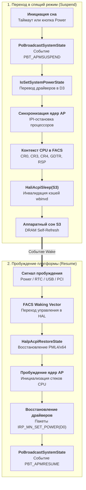

# 2. Спящий режим (Sleep S3 & Modern Standby S0ix)

Спящий режим переводит систему в состояние пониженного энергопотребления с сохранением рабочего сеанса пользователя. В современных системах применяются две различные архитектурные модели:
1. **Классический ACPI S3 (Suspend-to-RAM)**: питание подается исключительно на модули оперативной памяти (DRAM Self-Refresh), процессор и периферия обесточиваются, а аппаратный контекст регистров CPU сохраняется в таблицу FACS прошивки.
2. **Modern Standby (S0 Low Power Idle / S0ix)**: система непрерывно остается в состоянии `S0`, но платформа динамически погружается в субсостояния глубокого аппаратного простоя (DRIPS) под управлением координатора зависимостей питания PDC и плагина PEP.

---

## 2.1 Архитектурный конвейер перехода в сон S3 и пробуждения



---

## 2.2 Декомпилированный C-код входа в сон: `HaliAcpiSleep`

<FunctionCard 
  name="HaliAcpiSleep"
  module="hal.dll"
  :exported="false"
  prototype="__int64 __fastcall HaliAcpiSleep(ULONG SleepState, PVOID Handler, PVOID Context, ULONG ProcessorCount, volatile signed __int32 *SyncBarrier)"
  irql="HIGH_LEVEL (15/31)"
  caller="ntoskrnl.exe: PopInvokeSystemStateHandler"
  phase="HAL ACPI Hardware State Switch"
>
Низкоуровневая процедура аппаратного переключения чипсета и ядер процессора в ACPI S-состояния (S1–S4). Выполняет межъядерную синхронизацию, сброс кэшей (WBINVD), запись в регистры управления питанием PM1a_CNT/PM1b_CNT и обработку возобновления выполнения при пробуждении.
</FunctionCard>

<DecompiledCode 
  name="HaliAcpiSleep"
  module="hal.dll"
  callingConvention="__fastcall"
  :isExported="false"
  summary="Аппаратный перевод процессоров и чипсета в ACPI S-состояния и точка восстановления"
>

```c
__int64 __fastcall HaliAcpiSleep(
    ULONG SleepState,
    PVOID HandlerRoutine,
    PVOID Context,
    ULONG ProcessorCount,
    volatile signed __int32 *SyncBarrier)
{
  _disable(); // Блокировка прерываний (CLI)
  PKPRCB pPrcb = KeGetCurrentPrcb();
  ULONG CpuNum = pPrcb->Number;
  WORD pm1a_val;

  if ( CpuNum == 0 ) // Исполнение на загрузочном процессоре (BSP)
  {
    HalpAcpiPreSleep(SleepState);

    // [1] Настройка вектора пробуждения реального режима (Real-Mode Resume Stub)
    if ( (SleepState & 0x2000) != 0 )
      HalpSetupRealModeResume(HalpLowStub, HalpLowStubPhysicalAddress);

    // [2] Синхронизация со всеми ядрами AP через барьер
    _InterlockedIncrement(&HalpSaveStateSync);
    while ( HalpSaveStateSync != ProcessorCount )
      _mm_pause();

    // [3] Инвалидация и сброс кэшей процессора (Write-Back and Invalidate Cache)
    if ( (SleepState & 0x1000) != 0 )
    {
      if ( pPrcb->CpuVendor == CPU_INTEL )
        KeWriteProtectPAT(TRUE);
      __wbinvd();
    }

    // [4] Запись в регистры управления питанием ACPI (PM1a_CNT / PM1b_CNT)
    // Бит 13 = SLP_EN, биты 10-12 = SLP_TYP
    pm1a_val = (HalpAcpiPmRegisterRead(1) & 0x203) | ((SleepState & 7 | 8) << 10);
    HalpAcpiPmRegisterWrite(1, pm1a_val); // Переход платформы в ACPI S3

    // [5] Точка пробуждения: процессор восстанавливает исполнение отсюда после Waking Vector
    HalpAcpiPostSleep(SleepState);
  }
  else // Исполнение на вторичных ядрах AP
  {
    // [6] Сохранение аппаратного состояния вторичных процессоров
    HalpSaveProcessorState(HalpHiberProcState + 1472 * CpuNum);
    _InterlockedIncrement(&HalpSaveStateSync);

    HalpFlushAndWait(&HalpFlushBarrier);
    __wbinvd();
    HalpPostSleepMP(ProcessorCount);
  }

  return 0;
}
```

</DecompiledCode>

---

## 2.3 Модель Modern Standby (S0 Low Power Idle / S0ix)

В отличие от классического S3, в режиме **Modern Standby**:
1. **Отсутствие циклов обесточивания ОЗУ**: оперативная память работает в штатном режиме, что позволяет системе просыпаться мгновенно (< 500 мс).
2. **PDC (Power Dependency Coordinator)**: системный координатор отслеживает системные сущности (аудиопотоки, загрузку обновлений, таймеры push-уведомлений WNS).
3. **PEP (Power Engine Plugin)**: специализированный драйвер SoC от производителя чипсета (Intel / AMD / Qualcomm), переводящий шины PCIe, контроллеры дисплея и ядра CPU в состояние глубокого простоя `DRIPS` (Deepest Runtime Idle Platform State).
4. **Режимы активности (Connected vs Disconnected)**:
   - *Connected Standby*: сетевой адаптер периодически просыпается по триггерам паттернов (Wake-on-Pattern) для получения входящих звонков и сообщений.
   - *Disconnected Standby*: сетевой стек полностью отключается для максимальной экономии заряда аккумулятора.
