# 3. Гибернация (Hibernate S4) и Быстрый запуск (Fast Startup)

Гибернация позволяет полностью обесточить компьютер с сохранением состояния операционной системы на диск в файл `hiberfil.sys`. Режим **Быстрого запуска (Fast Startup / Hybrid Shutdown)** использует архитектуру гибернации для ускорения старта системы, сохраняя преднастроенное ядро и службы вместо их повторной медленной инициализации.

---

## 3.1 Архитектурный конвейер сохранения и восстановления снимка S4

```mermaid
flowchart LR
    subgraph HIBER_SAVE ["1. Создание снимка S4 (ntoskrnl.exe)"]
        direction TB
        H1["<b>Инициация S4</b><br/>NtSetSystemPowerState"]
        H1 --> H2["<b>PopAllocateHiberContext</b><br/>Разметка hiberfil.sys"]
        H2 --> H3["<b>IoSetSystemPowerState</b><br/>Перевод драйверов в D3"]
        H3 --> H4["<b>IoInitializeDumpStack</b><br/>Инициализация dump_*.sys"]
        H4 --> H5["<b>PopSaveHiberContext</b><br/>Сжатие ОЗУ (Xpress)"]
        H5 --> H6["<b>PopWriteHiberImage</b><br/>Запись в hiberfil.sys"]
        H6 --> H7["<b>PopWriteImageHeader</b><br/>Заголовок PO_MEMORY_IMAGE"]
        H7 --> H8["<b>PopBcdSetPendingResume</b><br/>Флаг resume в BCD"]
        H8 --> H9["<b>HaliAcpiSleep(S4)</b><br/>Обесточивание (S5)"]
    end

    subgraph HIBER_RESUME ["2. Восстановление снимка (winresume.efi)"]
        direction TB
        R1["<b>Включение ПК</b><br/>bootmgfw.efi"]
        R1 --> R2["<b>Проверка BCD</b><br/>Снимок hiberfil.sys"]
        R2 --> R3["<b>winresume.efi</b><br/>Resume Application"]
        R3 --> R4["<b>Чтение заголовка</b><br/>Проверка контрольной суммы"]
        R4 --> R5["<b>Декомпрессия ОЗУ</b><br/>Восстановление памяти"]
        R5 --> R6["<b>Переход в ядро</b><br/>Точка PopSaveHiberContext"]
        R6 --> R7["<b>Восстановление драйверов</b><br/>Пакеты IRP_MN_SET_POWER"]
    end

    H9 ==>|Включение питания| R1
```



---

## 3.2 Декомпилированный C-код создания снимка: `PopSaveHiberContext`

<FunctionCard 
  name="PopSaveHiberContext"
  module="ntoskrnl.exe"
  :exported="false"
  prototype="__int64 __fastcall PopSaveHiberContext(ULONG_PTR BugCheckParameter3)"
  irql="HIGH_LEVEL (15/31)"
  caller="ntoskrnl.exe: PopInvokeSystemStateHandler"
  phase="Kernel Hibernation Image Serialization"
>
Главная процедура сериализации памяти ядра и пользовательского пространства в файл `hiberfil.sys`. Инициализирует минипорт аварийного дампа (`dump_stornvme.sys` / `dump_storahci.sys`) для записи в обход стандартного стека файловой системы, организует параллельное сжатие страниц ОЗУ всеми доступными ядрами CPU и записывает заголовок `PO_MEMORY_IMAGE_HEADER`.
</FunctionCard>

<DecompiledCode 
  name="PopSaveHiberContext"
  module="ntoskrnl.exe"
  callingConvention="__fastcall"
  :isExported="false"
  summary="Сжатие и запись страниц физической памяти в hiberfil.sys через crashdump-минипорт"
>

```c
__int64 __fastcall PopSaveHiberContext(ULONG_PTR BugCheckParameter3)
{
  ULONG CpuNum = KeGetCurrentPrcb()->Number;
  PVOID pDumpStack;
  ULONG_PTR pHiberContext;

  if ( CpuNum == 0 ) // BSP координатор
  {
    PopCheckpointSystemSleep(19);
    _disable();

    // [1] Инициализация стека дампа для прямой низкоуровневой записи на накопитель
    pDumpStack = *(PVOID *)(BugCheckParameter3 + 168);
    IoInitializeDumpStack(pDumpStack);

    // [2] Построение карты страниц физической памяти для сжатия
    PopMarkComponentsBootPhase((PVOID)BugCheckParameter3);
    PoHiberInProgress = 1;

    // [3] Запись заголовочных страниц образа гибернации
    pHiberContext = *(ULONG_PTR *)(BugCheckParameter3 + 200);
    PopWriteHeaderPages(BugCheckParameter3, pHiberContext);

    // [4] Сжатие и запись первой фазы памяти ядра (Non-Paged Pool, Kernel Code)
    PopWriteHiberImage(BugCheckParameter3);

    // [5] Синхронизация контрольной суммы и запись структуры PO_MEMORY_IMAGE_HEADER
    PopWriteChecksumPages(BugCheckParameter3);
    PopWriteImageHeader(BugCheckParameter3, pHiberContext, 0, __rdtsc());

    // [6] Чекпоинт перехода и отключение питания через HAL
    PopCheckpointSystemSleep(24);
    return 0;
  }
  else // Вторичные ядра AP участвуют в параллельном сжатии страниц памяти
  {
    // [7] Параллельное сжатие блоков ОЗУ алгоритмом Xpress
    PopCompressHiberBlocks(
        BugCheckParameter3,
        (CpuNum << 7) + *(_QWORD *)(BugCheckParameter3 + 264),
        1);

    _InterlockedIncrement((volatile signed __int32 *)(BugCheckParameter3 + 12));
    return 0;
  }
}
```

</DecompiledCode>

---

## 3.3 Архитектурные различия: Полный Hibernate (S4) vs Быстрый запуск (Fast Startup)

| Параметр | Полная гибернация (S4) | Быстрый запуск (Fast Startup / Hybrid) |
| :--- | :--- | :--- |
| **Пользовательские сессии (Session 1+)** | Полностью сохраняются в снимке со всеми открытыми окнами | Завершаются (`ExitWindowsEx`), пользователь выгружается |
| **Сессия системных служб (Session 0)** | Сохраняется в активном состоянии | Переводится в состояние сна и сохраняется |
| **Ядро и драйверы (`ntoskrnl.exe`)** | Сохраняются в состоянии сна | Сохраняются в инициализированном состоянии |
| **Размер снимка в `hiberfil.sys`** | Большой (объем всей используемой RAM) | Компактный (только ядро + службы, ~1.5–3 ГБ) |
| **Поведение при включении** | `winresume.efi` восстанавливает сессию пользователя | `winresume.efi` восстанавливает ядро и открывает экран блокировки `LogonUI.exe` |
| **Пропуск фаз инициализации ядра** | Да (`InitBootProcessor` и `Phase1InitializationDiscard` не вызываются) | Да (старт за 3–5 секунд вместо 15–25 секунд) |
