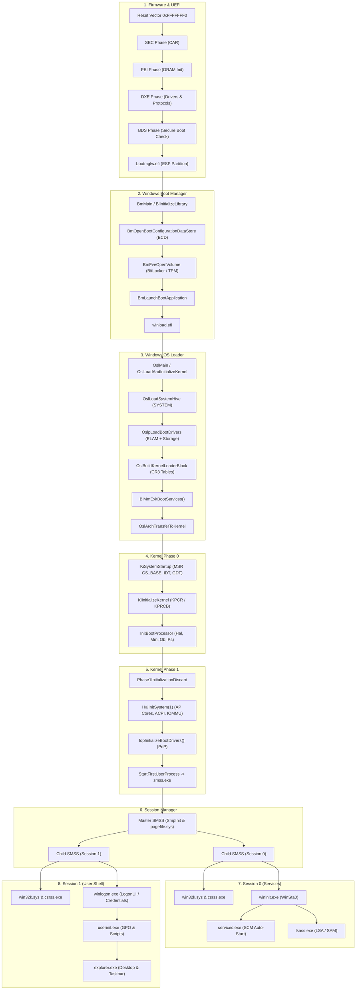

# Полная карта вызовов стека загрузки (Call Graph)

Иерархия вызовов ключевых функций от аппаратного сброса процессора до старта графической оболочки `explorer.exe`.

---

## 1. Высокоуровневая схема этапов загрузки

---

## 2. Граф стека запуска ОС

Детальный граф всех вызовов реальных системных функций, экспортированных из бинарных файлов Windows 11 (`bootmgfw.efi`, `winload.efi`, `ntoskrnl.exe`, `smss.exe`, `wininit.exe`, `services.exe`, `winlogon.exe`, `userinit.exe`, `explorer.exe`).

```mermaid
flowchart TD
    %% ==========================================
    %% 1. FIRMWARE & BOOT MANAGER
    %% ==========================================
    subgraph G1 ["1. Firmware & bootmgr.efi (Boot Manager)"]
        F1["_start / EfiEntry"] --> F2["BmMain"]
        F2 --> F3["BlInitializeLibrary"]
        F3 --> F3_1["BlMmInitialize (Page Allocator)"]
        F3 --> F3_2["BlArchInitialize (GDT / IDT / CR0 / CR4)"]
        F3 --> F3_3["BlDeviceInitialize (Block I/O Protocol)"]

        F2 --> F4["BmOpenBootConfigurationDataStore"]
        F4 --> F4_1["BcdOpenStore (\EFI\Microsoft\Boot\BCD)"]
        F4 --> F4_2["BiOpenKey -> BiGetRegistryValue"]

        F2 --> F5["BmGetBootSequence"]
        F5 --> F5_1["BmGetSelectedBootEntry ({default} / {current})"]

        F2 --> F6["BmFveOpenVolume (BitLocker / TPM)"]
        F6 --> F6_1["FveCheckVolumeStatus"]
        F6 --> F6_2["Tpm20GetCapability (PCR Sealed Keys)"]

        F2 --> F7["BmLaunchBootApplication"]
        F7 --> F7_1["BlImgLoadPEImageEx (winload.efi)"]
        F7 --> F7_2["BlImgAllocateImageBuffer"]
        F7 --> F7_3["OslpTransferToBootApplication"]
    end

    %% ==========================================
    %% 2. OS LOADER (WINLOAD.EFI)
    %% ==========================================
    subgraph G2 ["2. winload.efi (Windows OS Loader)"]
        F7_3 --> L1["OslMain / OslpMain"]
        L1 --> L2["OslpInitializeLoaderBlock (ALLOC_LOADER_BLOCK)"]
        
        L1 --> L3["OslLoadSystemHive"]
        L3 --> L3_1["OslpLoadSystemHiveWorker (\System32\config\SYSTEM)"]
        L3 --> L3_2["OslSetSystemHiveAddress (Virtual Mapping)"]

        L1 --> L4["OslpLoadBootDrivers"]
        L4 --> L4_1["OslpLoadAllModules (ntoskrnl.exe & hal.dll)"]
        L4 --> L4_2["OslpLoadDriver (ELAM: WdBoot.sys)"]
        L4 --> L4_3["OslpLoadDriver (Storage: storahci / nvme / scsi)"]

        L1 --> L5["OslBuildKernelLoaderBlock"]
        L5 --> L5_1["OslpCreatePageTables (PML4 / PDPT / PD / PT)"]
        L5 --> L5_2["OslpMapKernelAndHal (0xFFFFF80000000000)"]
        L5 --> L5_3["OslpBuildMemoryDescriptorList (LoaderBlock->MemoryDescriptorList)"]

        L1 --> L6["BlMmExitBootServices"]
        L6 --> L6_1["EfiBootServices->ExitBootServices(MapKey)"]

        L1 --> L7["OslArchTransferToKernel"]
    end

    %% ==========================================
    %% 3. KERNEL PHASE 0 (NTOSKRNL.EXE)
    %% ==========================================
    subgraph G3 ["3. ntoskrnl.exe (Phase 0: Executive Initialization)"]
        L7 --> K1["KiSystemStartup (BSP Entry)"]
        K1 --> K2["KiInitializeBootStructures"]
        K2 --> K2_1["wrmsr(MSR_GS_BASE, &KPCR)"]
        K2 --> K2_2["Init GDT, IDT (KiDivideErrorFault..KiPageFault)"]
        K2 --> K2_3["Init TSS (Task State Segment) & IST Stacks"]

        K1 --> K3["KiInitializeKernel"]
        K3 --> K3_1["KeInitializeProcess (InitialSystemProcess)"]
        K3 --> K3_2["KeInitializeThread (Phase 0 IdleThread)"]
        K3 --> K3_3["KiInitializeDpcQueues (KPRCB->DpcData)"]

        K3 --> K4["InitBootProcessor"]
        K4 --> K5["HalInitializeProcessor / HalInitSystem(0)"]
        K4 --> K6["MmInitSystem(0)"]
        K6 --> K6_1["MiInitializePfnDatabase"]
        K6 --> K6_2["MiInitializeSystemSpace"]
        K6 --> K6_3["MiInitializeNonPagedPool"]

        K4 --> K7["ObInitSystem(0) (Root Object Directory: \)"]
        K4 --> K8["SeInitSystem(0) (Tokens, System SID: S-1-5-18)"]
        K4 --> K9["PsInitSystem(0) (EPROCESS, ETHREAD structures)"]
        K4 --> K10["KeStartThread (Spawn Phase1Initialization Thread)"]
    end

    %% ==========================================
    %% 4. KERNEL PHASE 1 (DRIVERS & PNP)
    %% ==========================================
    subgraph G4 ["4. ntoskrnl.exe (Phase 1: Drivers & Subsystems)"]
        K10 --> P1["Phase1Initialization"]
        P1 --> P2["Phase1InitializationDiscard"]
        
        P2 --> P3["HalInitSystem(1)"]
        P3 --> P3_1["HalpAcpiInit (RSDP, XSDT, FADT, MADT)"]
        P3 --> P3_2["HalpStartProcessors (Wake AP Cores via IPI)"]
        P3 --> P3_3["HalpIommuInitialize (DMA Protection)"]

        P2 --> P4["PoInitSystem(1) (Power Management / PEP)"]
        P2 --> P5["CcInitializeCacheManager"]
        P2 --> P6["CmInitSystem1 (Registry Lock / Hive Flush)"]

        P2 --> P7["PpInitSystem (Plug and Play Manager)"]
        P7 --> P7_1["IopInitializeBootDrivers (BOOT_START Drivers)"]
        P7_2["DriverEntry -> AddDevice -> IRP_MN_START_DEVICE"]
        P7_1 --> P7_2

        P2 --> P8["MmInitSystem(1) (Unlock Working Sets, MiZeroPageWorker)"]
        P2 --> P9["SmCreateInitialSession"]
        P9 --> P10["StartFirstUserProcess"]
        P10 --> P10_1["RtlCreateUserProcess(\SystemRoot\System32\smss.exe)"]
    end

    %% ==========================================
    %% 5. SESSION MANAGER (SMSS.EXE)
    %% ==========================================
    subgraph G5 ["5. smss.exe (Session Manager Subsystem)"]
        P10_1 --> SM1["NtProcessStartupW -> wmain"]
        SM1 --> SM2["SmpInit"]
        SM2 --> SM2_1["RtlCreateTagHeap (SmBaseTag = 'SMSS!')"]
        SM2 --> SM2_2["SmpInitializeKnownSubSystems"]
        SM2 --> SM2_3["SmpCreateSecurityDescriptors"]
        SM2 --> SM2_4["NtAlpcCreatePort (\SmApiPort)"]
        SM2 --> SM2_5["SmpCreatePagingFiles (pagefile.sys & swapfile.sys)"]
        SM2_5 --> SM2_6["NtCreatePagingFile -> MiCreatePagingFile"]

        SM2 --> SM3["SmpInitPhase2"]
        SM3 --> SM4["SmpStartCsr (Start CSRSS for Session 0)"]
        SM4 --> SM4_1["SmpAllocateControlBlock"]
        SM4 --> SM4_2["SmpExecuteCommand (csrss.exe ObjectDirectory=\Windows)"]
        SM4 --> SM4_3["NtResumeThread (Run CSRSS Main Thread)"]

        SM3 --> SM5["SmpCreateInitialSession"]
        SM5 --> SM5_1["SmpExecuteCommand (Launch wininit.exe in Session 0)"]
        SM5 --> SM5_2["SmpExecuteCommand (Launch smss.exe -s 1 -> Child SMSS)"]

        SM5_2 --> SMC1["Child SMSS (smss.exe -s 1)"]
        SMC1 --> SMC2["SmscMain"]
        SMC2 --> SMC3["SmscpLoadSubSystemsForMuSession"]
        SMC3 --> SMC3_1["Load win32k.sys into Session Space"]
        SMC2 --> SMC4["SmpStartCsr (Start CSRSS for Session 1)"]
        SMC2 --> SMC5["SmpExecuteCommand (Launch winlogon.exe in Session 1)"]
    end

    %% ==========================================
    %% 6. SESSION 0 (WININIT & SERVICES)
    %% ==========================================
    subgraph G6 ["6. wininit.exe & services.exe (Session 0 Services)"]
        SM5_1 --> WI1["wininit.exe: WinMain"]
        WI1 --> WI2["RtlSetProcessIsCritical(1)"]
        WI1 --> WI3["CreateWindirTemp (\SystemRoot\Temp)"]
        WI1 --> WI4["?WinInitStartUp@@YAKXZ"]
        
        WI4 --> WI5["CheckWhetherSecureKernelIsRunning"]
        WI5 --> WI5_1["?StartSystemProcess (Launch lsaiso.exe for VBS)"]
        
        WI4 --> WI6["?StartSystemProcess (Launch lsass.exe)"]
        WI6 --> WI6_1["lsass.exe: LsaInitSystem (SAM, Kerberos, NTLM)"]

        WI4 --> WI7["?StartSystemProcess (Launch services.exe)"]
        
        WI7 --> SC1["services.exe: wmain -> SvcctrlMain"]
        SC1 --> SC2["ScCreateScManagerObject (\RPC Control\ntsvcs)"]
        SC1 --> SC3["ScInitDatabase (Read HKLM\SYSTEM\CCS\Services)"]
        SC1 --> SC4["ScCreateWellKnownSids & ScRemoveProcessPrivileges"]
        SC1 --> SC5["InitWudfDriverManager (UMDF Host)"]
        SC1 --> SC6["ScAutoStartServices"]
        SC6 --> SC6_1["Start Early: PlugPlay & Power Services"]
        SC6 --> SC6_2["CServiceDatabase::GetAutoStartServices"]
        SC6 --> SC6_3["ScStartService -> ScLogonAndStartImage (svchost.exe)"]
        SC6 --> SC6_4["Publish WNF_SCM_AUTOSTART_STATE (1 -> 2 -> 3)"]
    end

    %% ==========================================
    %% 7. SESSION 1 (WINLOGON, USERINIT, EXPLORER)
    %% ==========================================
    subgraph G7 ["7. winlogon.exe, userinit.exe & explorer.exe (Session 1 Shell)"]
        SMC5 --> WL1["winlogon.exe: WinMain"]
        WL1 --> WL2["CreatePrimaryTerminal (WinSta0)"]
        WL2 --> WL2_1["CreateDesktop (Winlogon, Default, Screen-Saver)"]
        
        WL1 --> WL3["StartLogonUI (LogonUI.exe on Winlogon Desktop)"]
        WL1 --> WL4["StateMachineRun (SAS / Credential Verification via ALPC to LSASS)"]
        
        WL4 --> WL5["WL_UserLogon (Token Creation & User Profile Load)"]
        WL5 --> WL6["CreateProcessAsUserW (userinit.exe on Default Desktop)"]

        WL6 --> UI1["userinit.exe: WinMain"]
        UI1 --> UI2["AllocAndGetEnvironmentVariable (UserInitLogonScript)"]
        UI1 --> UI3["RunLogonScript & RunMprLogonScripts (GPO Scripts)"]
        UI1 --> UI4["StartTheShell()"]
        UI4 --> UI4_1["CreateProcessW (explorer.exe)"]
        UI1 --> UI5["SetThreadPriority(-2) -> ExitProcess(0)"]

        UI4_1 --> EX1["explorer.exe: WinMain"]
        EX1 --> EX2["SetCurrentProcessExplicitAppUserModelID"]
        EX1 --> EX3["RunExplorerUnelevated (UAC Filter)"]
        EX1 --> EX4["SHCoInitialize & OleInitialize (STA Apartments)"]
        EX1 --> EX5["CreateDesktopAndTray"]
        EX5 --> EX5_1["CreateWindowEx (Shell_TrayWnd / Taskbar)"]
        EX5 --> EX5_2["CreateWindowEx (Progman / Desktop Icons)"]
        EX1 --> EX6["RunAllLogonTasks (Startup Registry & Shortcuts)"]
        EX1 --> EX7["SHDesktopMessageLoop (Main Windows Message Loop)"]
    end
```

