# Архитектурная карта cold-boot загрузки Windows 10 22H2 x64 (UEFI)

::: info Важно:
 Схема намеренно не включает альтернативные сценарии (Legacy BIOS/MBR, ARM64, VHD Boot, Network PXE, Safe Mode, WinRE, Hyper-V VBS), а также аварийные ветки обработки ошибок. Карта описывает обычный «холодный» старт **Windows 10 22H2 x64** (сборка 10.0.19045.2965) в режиме **UEFI Native** до оболочки по умолчанию
:::

```mermaid
flowchart TD
    %% ========================================================
    %% 1. FIRMWARE & UEFI
    %% ========================================================
    subgraph S1 ["1. x86/x64 UEFI Firmware (Typical PI Implementation)"]
        direction LR
        F_RST["<b>Reset Vector</b><br/>0xFFFFFFF0"] --> F_SEC["<b>SEC Phase</b><br/>Temporary Memory"] --> F_PEI["<b>PEI Phase</b><br/>DRAM Memory Init"] --> F_DXE["<b>DXE Phase</b><br/>UEFI Core Protocols"] --> F_BDS["<b>BDS Phase</b><br/>Boot Device Selection"]
        F_BDS --> F_SECURE["<b>UEFI Secure Boot</b><br/>Проверка bootmgfw.efi"]
    end

    %% ========================================================
    %% 2. WINDOWS BOOT MANAGER
    %% ========================================================
    subgraph S2 ["2. Windows Boot Manager (bootmgfw.efi)"]
        direction TB
        BM_MAIN["<b>BmMain</b><br/>Точка входа Boot Manager"]

        BM_MAIN --> BM_LIB["<b>BlInitializeLibrary</b><br/>Аллокатор BlMm и BlArch"]
        BM_MAIN --> BM_SEC["<b>BmSecureBootInitializeMachinePolicy</b><br/>Политики Secure Boot"]

        BM_MAIN --> BM_BCD["<b>BmOpenDataStore</b><br/>\\EFI\\Microsoft\\Boot\\BCD"]

        BM_MAIN --> BM_RES{"<b>BmResumeFromHibernate</b><br/>Проверка hiberfil.sys"}
        BM_RES -.->|Снимок валиден| BM_WINRESUME["<b>winresume.efi</b><br/>Восстановление памяти"]
        BM_RES -->|Cold Boot / Нет снимка| BM_SEQ["<b>BmGetBootSequence</b><br/>BmpPopulateBootEntryList"]

        BM_SEQ --> BM_LAUNCH["<b>BmpLaunchBootEntry</b>"]
        BM_LAUNCH --> BM_LOAD["<b>BlImgLoadBootApplication</b><br/>Загрузка winload.efi"]
        BM_LOAD --> BM_START["<b>BlImgStartBootApplication</b><br/>Запуск OS Loader"]
    end

    %% ========================================================
    %% 3. WINDOWS OS LOADER
    %% ========================================================
    subgraph S3 ["3. Windows OS Loader (winload.efi)"]
        direction TB
        WL_MAIN["<b>OslMain</b><br/>Точка входа Загрузчика ОС"]

        WL_MAIN --> WL_PREP["<b>OslPrepareTarget</b><br/>Подготовка компонентов ОС"]

        WL_PREP --> WL_MODS["<b>OslpLoadAllModules</b><br/>ntoskrnl, hal, kdcom, mcupdate"]
        WL_PREP --> WL_HIVE["<b>OslpLoadSystemHive</b><br/>Куст SYSTEM"]
        WL_PREP --> WL_ELAM["<b>ELAM Driver</b><br/>Ранняя защита (WdBoot.sys)"]
        WL_PREP --> WL_DRV["<b>BOOT_START Drivers</b><br/>storahci, stornvme, ntfs"]

        WL_MAIN --> WL_LDRBLK["<b>OslInitializeLoaderBlock</b><br/>LOADER_PARAMETER_BLOCK"]

        WL_MAIN --> WL_TRANS["<b>OslExecuteTransition</b>"]
        WL_TRANS --> WL_PAGE["<b>OslFwpKernelSetupPhase1</b><br/>CR3 & ExitBootServices"]
        WL_TRANS --> WL_ARCHTR["<b>OslArchTransferToKernel</b><br/>Контекст CPU и MSR"]
    end

    %% ========================================================
    %% 4. KERNEL PHASE 0
    %% ========================================================
    subgraph S4 ["4. Kernel Phase 0 (ntoskrnl.exe)"]
        direction TB
        K_START["<b>KiSystemStartup</b><br/>CR8=0 ➔ HIGH_LEVEL"]

        K_START --> K_GS["<b>wrmsr(MSR_GS_BASE, &KPCR)</b><br/>GS Base указывает на KPCR"]
        K_START --> K_BOOTSTR["<b>KiInitializeBootStructures</b><br/>Настройка GDT, IDT, XSave"]

        K_START --> K_INITK["<b>KiInitializeKernel</b><br/>KPRCB, IdleProcess, IdleThread"]
        
        K_IBP["<b>InitBootProcessor</b><br/>Координатор Phase 0"]
        K_INITK --> K_IBP
        K_IBP --> K_HAL0["<b>HalInitSystem(0)</b><br/>APIC и прерывания"]
        K_IBP --> K_CM0["<b>CmInitSystem0</b><br/>Куст SYSTEM"]
        K_IBP --> K_KE0["<b>KeInitSystem(0)</b><br/>Планировщик и DPC"]
        K_IBP --> K_EX0["<b>ExInitSystem</b><br/>Пулы памяти и дескрипторы"]
        K_IBP --> K_MM0["<b>MmInitSystem(0)</b><br/>PFN Database и PTE"]
        K_IBP --> K_OB0["<b>ObInitSystem(0)</b><br/>Корневой каталог объектов"]
        K_IBP --> K_SE0["<b>SeInitSystem(0)</b><br/>Токены безопасности и SID"]
        K_IBP --> K_PS0["<b>PsInitSystem(0)</b><br/>Создание процесса System (PID 4)"]

        K_PS0 --> K_THREAD["<b>PsCreateSystemThread</b><br/>Создание системного потока"]
        K_START --> K_IDLE["<b>KiIdleLoop</b><br/>Цикл простоя BSP"]
    end

    %% ========================================================
    %% 5. KERNEL PHASE 1
    %% ========================================================
    subgraph S5 ["5. Kernel Phase 1 (ntoskrnl.exe)"]
        direction TB
        P1_START["<b>Phase1InitializationDiscard</b><br/>IRQL PASSIVE_LEVEL"]

        P1_START --> P1_ROOT["<b>CreateSystemRootLink</b><br/>Ссылка \\SystemRoot"]
        P1_START --> P1_HAL1["<b>HalInitSystem(1)</b><br/>AP Cores, ACPI, IOMMU"]
        P1_START --> P1_MM1["<b>MmInitSystem(1)</b><br/>Рабочие наборы Working Sets"]
        P1_START --> P1_CC["<b>CcInitializeCacheManager</b><br/>Cache Manager"]
        P1_START --> P1_CM1["<b>CmInitSystem1</b><br/>Кусты SAM и SOFTWARE"]
        P1_START --> P1_PNP["<b>PpInitSystem</b><br/>PnP Manager"]
        P1_PNP --> P1_DRVENTRY["<b>IopInitializeBootDrivers</b><br/>Вызов DriverEntry драйверов"]
        P1_START --> P1_ALPC["<b>LpcInitSystem</b><br/>ALPC и Power Manager"]

        P1_START --> P1_USER["<b>StartFirstUserProcess</b><br/>Запуск smss.exe"]
    end

    %% ========================================================
    %% 6. SESSION MANAGER
    %% ========================================================
    subgraph S6 ["6. Session Manager (smss.exe)"]
        direction TB
        SM_MAIN["<b>smss.exe: NtProcessStartupW</b><br/>Master SMSS"]

        SM_MAIN --> SM_INIT["<b>SmpInit</b><br/>Инициализация подсистем"]
        SM_INIT --> SM_HEAP["<b>RtlCreateTagHeap</b><br/>Куча SMSS!"]
        SM_INIT --> SM_ENV["<b>BootExecute</b><br/>Окружение и autochk.exe"]
        SM_INIT --> SM_PORT["<b>NtAlpcCreatePort</b><br/>Порт \\SmApiPort"]
        SM_INIT --> SM_REG["<b>SmpLoadDataFromRegistry</b><br/>KnownDlls и DOS Devices"]
        SM_INIT --> SM_PAGE["<b>SmpCreatePagingFiles</b><br/>pagefile.sys / swapfile.sys"]

        SM_MAIN --> SM_SESS["<b>SmpCreateInitialSession</b><br/>Инициализация сессий"]

        SM_SESS --> S0_CSR["<b>csrss.exe</b><br/>Session 0 CSRSS"]
        SM_SESS --> S0_WININIT["<b>wininit.exe</b><br/>Старт Session 0"]

        SM_SESS --> S1_CHILD["<b>smss.exe -s 1</b><br/>Child SMSS (Сессия 1)"]

        S1_CHILD --> CH_MAIN["<b>Child SMSS: SmscMain</b><br/>Инициализация сессии"]
        CH_MAIN --> CH_WIN32K["<b>SmscpLoadSubSystems</b><br/>Загрузка win32k.sys"]
        CH_MAIN --> CH_CSR["<b>csrss.exe</b><br/>Session 1 CSRSS"]
        CH_MAIN --> CH_WINLOGON["<b>winlogon.exe</b><br/>Старт Session 1"]
    end

    %% ========================================================
    %% 7. SESSION 0 (SYSTEM SERVICES)
    %% ========================================================
    subgraph S7_0 ["7. Session 0 (System Services)"]
        direction TB
        WI_MAIN["<b>wininit.exe: WinMain</b>"] --> WI_CRIT["<b>RtlSetProcessIsCritical</b><br/>Флаг критического процесса"]
        WI_MAIN --> WI_PROCS["<b>WinInitStartUp</b><br/>Запуск служб (LSASS/SCM)"]
        WI_PROCS --> LSASS["<b>lsass.exe: LsaInitSystem</b><br/>LSA, SAM, Kerberos"]
        WI_PROCS --> SCM["<b>services.exe: SvcctrlMain</b><br/>Service Control Manager"]
        SCM --> SCM_AUTO["<b>ScAutoStartServices</b><br/>Автозапуск служб"]
        SCM_AUTO --> SVCHOST["<b>svchost.exe</b><br/>Хост системных служб"]
    end

    %% ========================================================
    %% 8. FIRST INTERACTIVE SESSION (TYPICALLY SESSION 1)
    %% ========================================================
    subgraph S7_1 ["8. First Interactive Session (Typically Session 1)"]
        direction TB
        WL_MAIN_ENTRY["<b>winlogon.exe: WinMain</b>"]
        WL_MAIN_ENTRY --> WL_WINSTA["<b>CreatePrimaryTerminal</b><br/>Оконная станция WinSta0"]
        WL_MAIN_ENTRY --> WL_LOGONUI["<b>LogonUI.exe</b><br/>Credential Providers (UI входа)"]
        WL_LOGONUI --> WL_AUTH["<b>LsaLogonUser</b><br/>Проверка учетных данных"]
        WL_AUTH --> WL_TOKEN["<b>User Logon Session</b><br/>Создание токена пользователя"]
        WL_TOKEN --> UI_LAUNCH["<b>CreateProcessAsUserW</b><br/>Запуск userinit.exe"]

        UI_LAUNCH --> UI_MAIN["<b>userinit.exe: WinMain</b>"]
        UI_MAIN --> UI_GPO["<b>Logon Policies</b><br/>Скрипты и политики входа"]
        UI_MAIN --> UI_SHELL["<b>Запуск Shell</b><br/>Запуск оболочки по умолчанию"]
        UI_SHELL --> EX_MAIN["<b>explorer.exe: WinMain</b><br/>Default Interactive Shell"]
        UI_MAIN --> UI_EXIT["<b>ExitProcess(0)</b><br/>Завершение userinit"]

        EX_MAIN --> EX_TRAY["<b>CreateDesktopAndTray</b><br/>Панель задач и рабочий стол"]
        EX_MAIN --> EX_TASKS["<b>Shell Startup</b><br/>Автозагрузка приложений"]
        EX_MAIN --> EX_LOOP["<b>SHDesktopMessageLoop</b><br/>Цикл оконных сообщений"]
    end

    %% ========================================================
    %% МЕЖМОДУЛЬНЫЕ ПЕРЕХОДЫ УПРАВЛЕНИЯ
    %% ========================================================
    F_SECURE ==>|Запуск проверенного EFI-образа| BM_MAIN
    BM_START ==>|Вызов точки входа winload.efi| WL_MAIN
    WL_ARCHTR ==>|Переход в ядро + LOADER_PARAMETER_BLOCK| K_START
    K_THREAD ==>|Исполнение системного потока в контексте System| P1_START
    P1_USER ==>|Старт первого процесса Ring 3| SM_MAIN
    S0_WININIT ==>|Старт Session 0| WI_MAIN
    CH_WINLOGON ==>|Старт Interactive Session| WL_MAIN_ENTRY

    %% Стили узлов и переходов
    classDef default fill:#0f172a,stroke:#334155,stroke-width:1px,color:#e2e8f0;
    classDef entryNode fill:#1e3a8a,stroke:#60a5fa,stroke-width:2px,color:#ffffff;
    classDef exitNode fill:#065f46,stroke:#34d399,stroke-width:2px,color:#ffffff;

    class F_RST,BM_MAIN,WL_MAIN,K_START,P1_START,SM_MAIN,WI_MAIN,WL_MAIN_ENTRY entryNode;
    class EX_LOOP,SVCHOST,K_IDLE,BM_WINRESUME exitNode;
```

