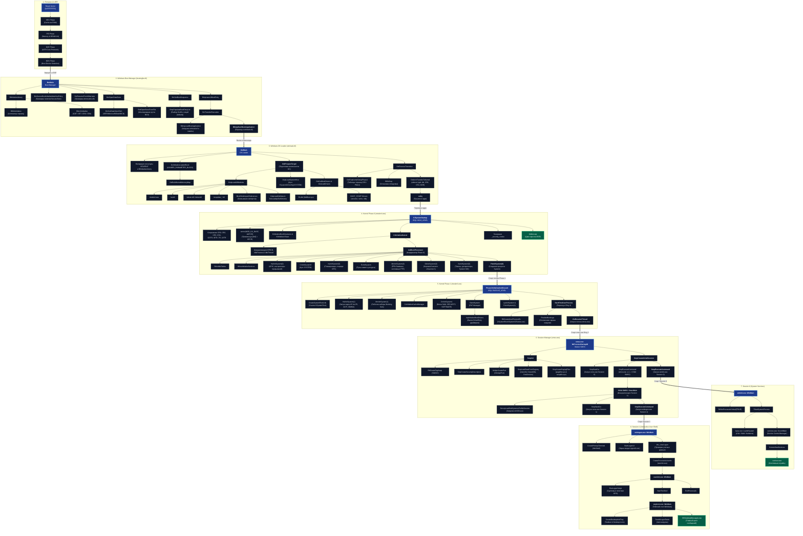

# Полная архитектурная карта вызовов стека загрузки

Схема вызовов всех ключевых функций процесса загрузки Windows NT (от аппаратного сброса до запуска оболочки `explorer.exe`). 

```mermaid
flowchart TD
    %% ========================================================
    %% 1. FIRMWARE & UEFI
    %% ========================================================
    subgraph S1 ["1. Firmware & UEFI"]
        direction LR
        F_RST["Reset Vector<br/>(0xFFFFFFF0)"] --> F_SEC["SEC Phase<br/>(Cache-as-RAM)"] --> F_PEI["PEI Phase<br/>(Memory & DRAM Init)"] --> F_DXE["DXE Phase<br/>(UEFI Core Protocols)"] --> F_BDS["BDS Phase<br/>(Boot Device Selection)"]
    end

    %% ========================================================
    %% 2. WINDOWS BOOT MANAGER
    %% ========================================================
    subgraph S2 ["2. Windows Boot Manager (bootmgfw.efi)"]
        direction TB
        BM_MAIN["<b>BmMain</b><br/>Boot Manager"]

        BM_MAIN --> BM_LIB["BlInitializeLibrary"]
        BM_LIB --> BM_MM["BlMmInitialize<br/>(Аллокатор страниц)"]
        BM_LIB --> BM_ARCH["BlArchInitialize<br/>(GDT / IDT / CR0 / CR4)"]

        BM_MAIN --> BM_SEC["BmSecureBootInitializeMachinePolicy<br/>(Проверка политик Secure Boot)"]
        BM_MAIN --> BM_RES["BmResumeFromHibernate<br/>(Проверка winresume.efi)"]

        BM_MAIN --> BM_BCD["BmOpenDataStore"]
        BM_BCD --> BM_BCDPATH["BmGetDataStorePath<br/>(\\EFI\\Microsoft\\Boot\\BCD)"]
        BM_BCD --> BM_BCDHIVE["BcdOpenStoreFromFile<br/>(Монтирование куста BCD)"]

        BM_MAIN --> BM_SEQ["BmGetBootSequence"]
        BM_SEQ --> BM_POP["BmpPopulateBootEntryList<br/>(Разбор GUID и опций {default})"]

        BM_MAIN --> BM_LAUNCH["BmpLaunchBootEntry"]
        BM_LAUNCH --> BM_TRANS["BmTransferExecution"]
        BM_TRANS --> BM_LOAD["BlImgLoadBootApplication<br/>(Загрузка winload.efi в память)"]
        BM_TRANS --> BM_START["<b>BlImgStartBootApplication</b><br/>(Переход в winload.efi)"]
    end

    %% ========================================================
    %% 3. WINDOWS OS LOADER
    %% ========================================================
    subgraph S3 ["3. Windows OS Loader (winload.efi)"]
        direction TB
        WL_MAIN["<b>OslMain</b><br/>OS Loader"]

        WL_MAIN --> WL_SIG["Валидация сигнатуры BTAPENT<br/>и BlInitializeLibrary"]
        WL_MAIN --> WL_LDRBLK["OslInitializeLoaderBlock<br/>(LOADER_PARAMETER_BLOCK)"]
        WL_LDRBLK --> WL_MEMMAP["OslBuildKernelMemoryMap"]

        WL_MAIN --> WL_PREP["<b>OslPrepareTarget</b><br/>(Подготовка компонентов ОС)"]

        WL_PREP --> WL_MODS["OslpLoadAllModules"]
        WL_MODS --> WL_NTOS["ntoskrnl.exe"]
        WL_MODS --> WL_HAL["hal.dll"]
        WL_MODS --> WL_KD["kdcom.dll / kdnet.dll"]
        WL_MODS --> WL_MC["mcupdate_*.dll"]
        WL_MODS --> WL_BIND["BlLdrBindImportReferences<br/>(Связывание импортов)"]
        WL_MODS --> WL_NLS["OslpLoadNlsData &<br/>OslLoadApiSetSchema"]

        WL_PREP --> WL_HIVE["OslpLoadSystemHive<br/>(Куст \\System32\\config\\SYSTEM)"]

        WL_PREP --> WL_DRV["OslGetBootDrivers & OslLoadDrivers"]
        WL_DRV --> WL_ELAM["ELAM (WdBoot.sys)"]
        WL_DRV --> WL_BOOTDRV["BOOT_START Drivers<br/>(storahci, nvme, ntfs)"]

        WL_MAIN --> WL_TRANS["OslExecuteTransition"]
        WL_TRANS --> WL_PAGE["OslFwpKernelSetupPhase1<br/>(Таблицы страниц CR3 / PML4)"]
        WL_TRANS --> WL_BDSTOP["BlBdStop<br/>(Остановка отладчика)"]
        WL_TRANS --> WL_ARCHTR["OslArchTransferToKernel<br/>(wbinvd, lgdt, lidt, CR0, CR4, MSR)"]
        WL_ARCHTR --> WL_RETFQ["<b>retfq</b><br/>(Прыжок в ядро)"]
    end

    %% ========================================================
    %% 4. KERNEL PHASE 0
    %% ========================================================
    subgraph S4 ["4. Kernel Phase 0 (ntoskrnl.exe)"]
        direction TB
        K_START["<b>KiSystemStartup</b><br/>IRQL HIGH_LEVEL"]

        K_START --> K_REGS["Сохранение CR0, CR2, CR3, CR4,<br/>GDTR, IDTR, TR, LDTR"]
        K_START --> K_GS["wrmsr(MSR_GS_BASE, &KPCR)<br/>(Привязка gs:[0x0] = KPCR)"]
        K_START --> K_BOOTSTR["KiInitializeBootStructures &<br/>KiInitializeXSave"]

        K_START --> K_INITK["<b>KiInitializeKernel</b>"]
        K_INITK --> K_PRCB["Инициализация KPRCB,<br/>IdleProcess & IdleThread"]
        
        K_INITK --> K_IBP["<b>InitBootProcessor</b><br/>(Координатор Phase 0)"]
        K_IBP --> K_NLS["RtlInitNlsTables"]
        K_IBP --> K_WHEA["WheaInitializeServices"]
        K_IBP --> K_HAL0["HalInitSystem(0)<br/>(APIC, контроллеры прерываний)"]
        K_IBP --> K_CM0["CmInitSystem0<br/>(Куст SYSTEM)"]
        K_IBP --> K_KE0["KeInitSystem(0)<br/>(Планировщик, очереди DPC)"]
        K_IBP --> K_EX0["ExInitSystem<br/>(Пулы памяти, ресурсы)"]
        K_IBP --> K_MM0["MmInitSystem(0)<br/>(PFN Database, системные PTE)"]
        K_IBP --> K_OB0["ObInitSystem(0)<br/>(Корневой каталог объектов \\)"]
        K_IBP --> K_SE0["SeInitSystem(0)<br/>(Токены, дескрипторы, System SID)"]
        K_IBP --> K_PS0["<b>PsInitSystem(0)</b><br/>(Создание процесса System)"]

        K_START --> K_COOKIE["Генерация _security_cookie"]
        K_START --> K_IDLE["KiIdleLoop<br/>(Цикл простоя BSP)"]
    end

    %% ========================================================
    %% 5. KERNEL PHASE 1
    %% ========================================================
    subgraph S5 ["5. Kernel Phase 1 (ntoskrnl.exe)"]
        direction TB
        P1_START["<b>Phase1InitializationDiscard</b><br/>IRQL PASSIVE_LEVEL"]

        P1_START --> P1_ROOT["CreateSystemRootLink<br/>(Ссылка \\SystemRoot)"]
        P1_START --> P1_HAL1["HalInitSystem(1)<br/>(Запуск ядер AP via IPI, ACPI, IOMMU)"]
        P1_START --> P1_MM1["MmInitSystem(1)<br/>(Рабочие наборы Working Sets)"]
        P1_START --> P1_CC["CcInitializeCacheManager"]
        P1_START --> P1_CM1["CmInitSystem1<br/>(Ветки SAM, SECURITY, SOFTWARE)"]
        P1_START --> P1_PNP["PpInitSystem<br/>(PnP Manager)"]
        P1_PNP --> P1_DRVENTRY["IopInitializeBootDrivers<br/>(Вызов DriverEntry драйверов)"]
        P1_START --> P1_ALPC["LpcInitSystem &<br/>PoInitSystem(1)"]

        P1_START --> P1_USER["<b>StartFirstUserProcess</b><br/>(Переход в Ring 3)"]
        P1_USER --> P1_RTLPROC["RtlCreateUserProcessEx<br/>(\\SystemRoot\\System32\\smss.exe)"]
        P1_USER --> P1_LOGO["FinalizeBootLogo<br/>(Отключение экрана загрузки)"]
        P1_USER --> P1_RESUME["<b>ZwResumeThread</b><br/>(Запуск потока smss.exe)"]
    end

    %% ========================================================
    %% 6. SESSION MANAGER
    %% ========================================================
    subgraph S6 ["6. Session Manager (smss.exe)"]
        direction TB
        SM_MAIN["<b>smss.exe: NtProcessStartupW</b><br/>Master SMSS"]

        SM_MAIN --> SM_INIT["<b>SmpInit</b>"]
        SM_INIT --> SM_HEAP["RtlCreateTagHeap ('SMSS!')"]
        SM_INIT --> SM_SEC["SmpCreateSecurityDescriptors"]
        SM_INIT --> SM_PORT["NtAlpcCreatePort<br/>(\\SmApiPort)"]
        SM_INIT --> SM_REG["SmpLoadDataFromRegistry<br/>(Autochk, KnownDlls, DosDevices)"]
        SM_INIT --> SM_PAGE["SmpCreatePagingFiles<br/>(pagefile.sys & swapfile.sys)"]

        SM_MAIN --> SM_SESS["<b>SmpCreateInitialSession</b>"]

        SM_SESS --> S0_CSR["SmpStartCsr<br/>(Запуск csrss.exe Session 0)"]
        SM_SESS --> S0_WININIT["<b>SmpExecuteCommand</b><br/>(Запуск wininit.exe Session 0)"]

        SM_SESS --> S1_CHILD["SmpExecuteCommand<br/>(smss.exe -s 1 -> Child SMSS)"]

        S1_CHILD --> CH_MAIN["<b>Child SMSS: SmscMain</b><br/>(Инициализация Session 1)"]
        CH_MAIN --> CH_WIN32K["SmscpLoadSubSystemsForMuSession<br/>(Загрузка win32k.sys)"]
        CH_MAIN --> CH_CSR["SmpStartCsr<br/>(Запуск csrss.exe Session 1)"]
        CH_MAIN --> CH_WINLOGON["<b>SmpExecuteCommand</b><br/>(Запуск winlogon.exe Session 1)"]
    end

    %% ========================================================
    %% 7. SESSION 0 (SYSTEM SERVICES)
    %% ========================================================
    subgraph S7_0 ["7. Session 0 (System Services)"]
        direction TB
        WI_MAIN["<b>wininit.exe: WinMain</b>"] --> WI_CRIT["RtlSetProcessIsCritical(TRUE)"]
        WI_MAIN --> WI_PROCS["?StartSystemProcess"]
        WI_PROCS --> LSASS["lsass.exe: LsaInitSystem<br/>(LSA / SAM / Kerberos)"]
        WI_PROCS --> SCM["services.exe: SvcctrlMain<br/>(Service Control Manager)"]
        SCM --> SCM_AUTO["ScAutoStartServices"]
        SCM_AUTO --> SVCHOST["svchost.exe<br/>(Системные службы)"]
    end

    %% ========================================================
    %% 8. SESSION 1 (INTERACTIVE USER SHELL)
    %% ========================================================
    subgraph S7_1 ["8. Session 1 (Interactive User Shell)"]
        direction TB
        WL_MAIN_ENTRY["<b>winlogon.exe: WinMain</b>"]
        WL_MAIN_ENTRY --> WL_WINSTA["CreatePrimaryTerminal (WinSta0)"]
        WL_MAIN_ENTRY --> WL_LOGONUI["StartLogonUI<br/>(Экран входа LogonUI.exe)"]
        WL_MAIN_ENTRY --> WL_AUTH["WL_UserLogon<br/>(Проверка учетных данных)"]
        WL_AUTH --> UI_LAUNCH["CreateProcessAsUserW<br/>(userinit.exe)"]

        UI_LAUNCH --> UI_MAIN["<b>userinit.exe: WinMain</b>"]
        UI_MAIN --> UI_GPO["RunLogonScript<br/>(Групповые политики GPO)"]
        UI_MAIN --> UI_SHELL["StartTheShell"]
        UI_SHELL --> EX_MAIN["<b>explorer.exe: WinMain</b><br/>(Рабочий стол Windows)"]
        UI_MAIN --> UI_EXIT["ExitProcess(0)"]

        EX_MAIN --> EX_TRAY["CreateDesktopAndTray<br/>(Taskbar & Desktop Icons)"]
        EX_MAIN --> EX_TASKS["RunAllLogonTasks<br/>(Автозагрузка)"]
        EX_MAIN --> EX_LOOP["SHDesktopMessageLoop<br/>(Главный цикл сообщений)"]
    end

    %% ========================================================
    %% МЕЖМОДУЛЬНЫЕ ПЕРЕХОДЫ УПРАВЛЕНИЯ
    %% ========================================================
    F_BDS ==>|Загрузка с ESP| BM_MAIN
    BM_START ==>|Вызов точки входа| WL_MAIN
    WL_RETFQ ==>|Переход в ядро| K_START
    K_PS0 ==>|Старт потока Phase 1| P1_START
    P1_RESUME ==>|Старт smss.exe Ring 3| SM_MAIN
    S0_WININIT ==>|Старт Session 0| WI_MAIN
    CH_WINLOGON ==>|Старт Session 1| WL_MAIN_ENTRY

    %% Стили узлов и переходов
    classDef default fill:#0f172a,stroke:#334155,stroke-width:1px,color:#e2e8f0;
    classDef entryNode fill:#1e3a8a,stroke:#60a5fa,stroke-width:2px,color:#ffffff;
    classDef exitNode fill:#065f46,stroke:#34d399,stroke-width:2px,color:#ffffff;

    class F_RST,BM_MAIN,WL_MAIN,K_START,P1_START,SM_MAIN,WI_MAIN,WL_MAIN_ENTRY entryNode;
    class EX_LOOP,SVCHOST,K_IDLE exitNode;
```
