```mermaid
flowchart TD
    %% ========================================================
    %% 1. FIRMWARE & UEFI
    %% ========================================================
    subgraph S1 ["1. x86/x64 UEFI Firmware (Typical PI Implementation)"]
        direction LR
        F_RST["<b>Reset Vector</b><br/>0xFFFFFFF0"] --> F_SEC["<b>SEC Phase</b><br/>Temporary Memory"] --> F_PEI["<b>PEI Phase</b><br/>DRAM Memory Init"] --> F_DXE["<b>DXE Phase</b><br/>UEFI Core Protocols"] --> F_BDS["<b>BDS Phase</b><br/>Boot Device Selection"]
        F_BDS --> F_SECURE["<b>UEFI Secure Boot</b><br/>Проверка bootmgfw.efi"]
    end

    %% ========================================================
    %% 2. WINDOWS BOOT MANAGER
    %% ========================================================
    subgraph S2 ["2. Windows Boot Manager (bootmgfw.efi)"]
        direction TB
        BM_MAIN["<b>BmMain</b><br/>Точка входа Boot Manager"]

        BM_MAIN --> BM_LIB["<b>BlInitializeLibrary</b><br/>Аллокатор BlMm и BlArch"]
        BM_MAIN --> BM_SEC["<b>BmSecureBootInitializeMachinePolicy</b><br/>Политики Secure Boot"]

        BM_MAIN --> BM_BCD["<b>BmOpenDataStore</b><br/>\\EFI\\Microsoft\\Boot\\BCD"]

        BM_MAIN --> BM_RES{"<b>BmResumeFromHibernate</b><br/>Проверка hiberfil.sys"}
        BM_RES -.->|Снимок валиден| BM_WINRESUME["<b>winresume.efi</b><br/>Восстановление памяти"]
        BM_RES -->|Cold Boot / Нет снимка| BM_SEQ["<b>BmGetBootSequence</b><br/>BmpPopulateBootEntryList"]

        BM_SEQ --> BM_LAUNCH["<b>BmpLaunchBootEntry</b>"]
        BM_LAUNCH --> BM_LOAD["<b>BlImgLoadBootApplication</b><br/>Загрузка winload.efi"]
        BM_LOAD --> BM_START["<b>BlImgStartBootApplication</b><br/>Запуск OS Loader"]
    end

    %% ========================================================
    %% 3. WINDOWS OS LOADER
    %% ========================================================
    subgraph S3 ["3. Windows OS Loader (winload.efi)"]
        direction TB
        WL_MAIN["<b>OslMain</b><br/>Точка входа Загрузчика ОС"]

        WL_MAIN --> WL_PREP["<b>OslPrepareTarget</b><br/>Подготовка компонентов ОС"]

        WL_PREP --> WL_MODS["<b>OslpLoadAllModules</b><br/>ntoskrnl, hal, kdcom, mcupdate"]
        WL_PREP --> WL_HIVE["<b>OslpLoadSystemHive</b><br/>Куст SYSTEM"]
        WL_PREP --> WL_ELAM["<b>ELAM Driver</b><br/>Ранняя защита (WdBoot.sys)"]
        WL_PREP --> WL_DRV["<b>BOOT_START Drivers</b><br/>storahci, stornvme, ntfs"]

        WL_MAIN --> WL_LDRBLK["<b>OslInitializeLoaderBlock</b><br/>LOADER_PARAMETER_BLOCK"]

        WL_MAIN --> WL_TRANS["<b>OslExecuteTransition</b>"]
        WL_TRANS --> WL_PAGE["<b>OslFwpKernelSetupPhase1</b><br/>CR3 & ExitBootServices"]
        WL_TRANS --> WL_ARCHTR["<b>OslArchTransferToKernel</b><br/>Контекст CPU и MSR"]
    end

    %% ========================================================
    %% 4. KERNEL PHASE 0
    %% ========================================================
    subgraph S4 ["4. Kernel Phase 0 (ntoskrnl.exe)"]
        direction TB
        K_START["<b>KiSystemStartup</b><br/>CR8=0 ➔ HIGH_LEVEL"]

        K_START --> K_GS["<b>wrmsr(MSR_GS_BASE, &KPCR)</b><br/>GS Base указывает на KPCR"]
        K_START --> K_BOOTSTR["<b>KiInitializeBootStructures</b><br/>Настройка GDT, IDT, XSave"]

        K_START --> K_INITK["<b>KiInitializeKernel</b><br/>KPRCB, IdleProcess, IdleThread"]
        
        K_IBP["<b>InitBootProcessor</b><br/>Координатор Phase 0"]
        K_INITK --> K_IBP
        K_IBP --> K_HAL0["<b>HalInitSystem(0)</b><br/>APIC и прерывания"]
        K_IBP --> K_CM0["<b>CmInitSystem0</b><br/>Куст SYSTEM"]
        K_IBP --> K_KE0["<b>KeInitSystem(0)</b><br/>Планировщик и DPC"]
        K_IBP --> K_EX0["<b>ExInitSystem</b><br/>Пулы памяти и дескрипторы"]
        K_IBP --> K_MM0["<b>MmInitSystem(0)</b><br/>PFN Database и PTE"]
        K_IBP --> K_OB0["<b>ObInitSystem(0)</b><br/>Корневой каталог объектов"]
        K_IBP --> K_SE0["<b>SeInitSystem(0)</b><br/>Токены безопасности и SID"]
        K_IBP --> K_PS0["<b>PsInitSystem(0)</b><br/>Создание процесса System (PID 4)"]

        K_PS0 --> K_THREAD["<b>PsCreateSystemThread</b><br/>Создание системного потока"]
        K_START --> K_IDLE["<b>KiIdleLoop</b><br/>Цикл простоя BSP"]
    end

    %% ========================================================
    %% 5. KERNEL PHASE 1
    %% ========================================================
    subgraph S5 ["5. Kernel Phase 1 (ntoskrnl.exe)"]
        direction TB
        P1_START["<b>Phase1InitializationDiscard</b><br/>IRQL PASSIVE_LEVEL"]

        P1_START --> P1_ROOT["<b>CreateSystemRootLink</b><br/>Ссылка \\SystemRoot"]
        P1_START --> P1_HAL1["<b>HalInitSystem(1)</b><br/>AP Cores, ACPI, IOMMU"]
        P1_START --> P1_MM1["<b>MmInitSystem(1)</b><br/>Рабочие наборы Working Sets"]
        P1_START --> P1_CC["<b>CcInitializeCacheManager</b><br/>Cache Manager"]
        P1_START --> P1_CM1["<b>CmInitSystem1</b><br/>Кусты SAM и SOFTWARE"]
        P1_START --> P1_PNP["<b>PpInitSystem</b><br/>PnP Manager"]
        P1_PNP --> P1_DRVENTRY["<b>IopInitializeBootDrivers</b><br/>Вызов DriverEntry драйверов"]
        P1_START --> P1_ALPC["<b>LpcInitSystem</b><br/>ALPC и Power Manager"]

        P1_START --> P1_USER["<b>StartFirstUserProcess</b><br/>Запуск smss.exe"]
    end

    %% ========================================================
    %% 6. SESSION MANAGER
    %% ========================================================
    subgraph S6 ["6. Session Manager (smss.exe)"]
        direction TB
        SM_MAIN["<b>smss.exe: NtProcessStartupW</b><br/>Master SMSS"]

        SM_MAIN --> SM_INIT["<b>SmpInit</b><br/>Инициализация подсистем"]
        SM_INIT --> SM_HEAP["<b>RtlCreateTagHeap</b><br/>Куча SMSS!"]
        SM_INIT --> SM_ENV["<b>BootExecute</b><br/>Окружение и autochk.exe"]
        SM_INIT --> SM_PORT["<b>NtAlpcCreatePort</b><br/>Порт \\SmApiPort"]
        SM_INIT --> SM_REG["<b>SmpLoadDataFromRegistry</b><br/>KnownDlls и DOS Devices"]
        SM_INIT --> SM_PAGE["<b>SmpCreatePagingFiles</b><br/>pagefile.sys / swapfile.sys"]

        SM_MAIN --> SM_SESS["<b>SmpCreateInitialSession</b><br/>Инициализация сессий"]

        SM_SESS --> S0_CSR["<b>csrss.exe</b><br/>Session 0 CSRSS"]
        SM_SESS --> S0_WININIT["<b>wininit.exe</b><br/>Старт Session 0"]

        SM_SESS --> S1_CHILD["<b>smss.exe -s 1</b><br/>Child SMSS (Сессия 1)"]

        S1_CHILD --> CH_MAIN["<b>Child SMSS: SmscMain</b><br/>Инициализация сессии"]
        CH_MAIN --> CH_WIN32K["<b>SmscpLoadSubSystems</b><br/>Загрузка win32k.sys"]
        CH_MAIN --> CH_CSR["<b>csrss.exe</b><br/>Session 1 CSRSS"]
        CH_MAIN --> CH_WINLOGON["<b>winlogon.exe</b><br/>Старт Session 1"]
    end

    %% ========================================================
    %% 7. SESSION 0 (SYSTEM SERVICES)
    %% ========================================================
    subgraph S7_0 ["7. Session 0 (System Services)"]
        direction TB
        WI_MAIN["<b>wininit.exe: WinMain</b>"] --> WI_CRIT["<b>RtlSetProcessIsCritical</b><br/>Флаг критического процесса"]
        WI_MAIN --> WI_PROCS["<b>WinInitStartUp</b><br/>Запуск служб (LSASS/SCM)"]
        WI_PROCS --> LSASS["<b>lsass.exe: LsaInitSystem</b><br/>LSA, SAM, Kerberos"]
        WI_PROCS --> SCM["<b>services.exe: SvcctrlMain</b><br/>Service Control Manager"]
        SCM --> SCM_AUTO["<b>ScAutoStartServices</b><br/>Автозапуск служб"]
        SCM_AUTO --> SVCHOST["<b>svchost.exe</b><br/>Хост системных служб"]
    end

    %% ========================================================
    %% 8. FIRST INTERACTIVE SESSION (TYPICALLY SESSION 1)
    %% ========================================================
    subgraph S7_1 ["8. First Interactive Session (Typically Session 1)"]
        direction TB
        WL_MAIN_ENTRY["<b>winlogon.exe: WinMain</b>"]
        WL_MAIN_ENTRY --> WL_WINSTA["<b>CreatePrimaryTerminal</b><br/>Оконная станция WinSta0"]
        WL_MAIN_ENTRY --> WL_LOGONUI["<b>LogonUI.exe</b><br/>Credential Providers (UI входа)"]
        WL_LOGONUI --> WL_AUTH["<b>LsaLogonUser</b><br/>Проверка учетных данных"]
        WL_AUTH --> WL_TOKEN["<b>User Logon Session</b><br/>Создание токена пользователя"]
        WL_TOKEN --> UI_LAUNCH["<b>CreateProcessAsUserW</b><br/>Запуск userinit.exe"]

        UI_LAUNCH --> UI_MAIN["<b>userinit.exe: WinMain</b>"]
        UI_MAIN --> UI_GPO["<b>Logon Policies</b><br/>Скрипты и политики входа"]
        UI_MAIN --> UI_SHELL["<b>Запуск Shell</b><br/>Запуск оболочки по умолчанию"]
        UI_SHELL --> EX_MAIN["<b>explorer.exe: WinMain</b><br/>Default Interactive Shell"]
        UI_MAIN --> UI_EXIT["<b>ExitProcess(0)</b><br/>Завершение userinit"]

        EX_MAIN --> EX_TRAY["<b>CreateDesktopAndTray</b><br/>Панель задач и рабочий стол"]
        EX_MAIN --> EX_TASKS["<b>Shell Startup</b><br/>Автозагрузка приложений"]
        EX_MAIN --> EX_LOOP["<b>SHDesktopMessageLoop</b><br/>Цикл оконных сообщений"]
    end

    %% ========================================================
    %% МЕЖМОДУЛЬНЫЕ ПЕРЕХОДЫ УПРАВЛЕНИЯ
    %% ========================================================
    F_SECURE ==>|Запуск проверенного EFI-образа| BM_MAIN
    BM_START ==>|Вызов точки входа winload.efi| WL_MAIN
    WL_ARCHTR ==>|Переход в ядро + LOADER_PARAMETER_BLOCK| K_START
    K_THREAD ==>|Исполнение системного потока в контексте System| P1_START
    P1_USER ==>|Старт первого процесса Ring 3| SM_MAIN
    S0_WININIT ==>|Старт Session 0| WI_MAIN
    CH_WINLOGON ==>|Старт Interactive Session| WL_MAIN_ENTRY

    %% Стили узлов и переходов
    classDef default fill:#0f172a,stroke:#334155,stroke-width:1px,color:#e2e8f0;
    classDef entryNode fill:#1e3a8a,stroke:#60a5fa,stroke-width:2px,color:#ffffff;
    classDef exitNode fill:#065f46,stroke:#34d399,stroke-width:2px,color:#ffffff;

    class F_RST,BM_MAIN,WL_MAIN,K_START,P1_START,SM_MAIN,WI_MAIN,WL_MAIN_ENTRY entryNode;
    class EX_LOOP,SVCHOST,K_IDLE,BM_WINRESUME exitNode;
```

# 1. Firmware & UEFI / MBR Stage

Этап аппаратной инициализации прошивки материнской платы и передачи управления первому загрузчику Windows.

---

## 1.1 Сквозная архитектурная карта cold-boot загрузки (UEFI x64)

::: info Важно:
Карта описывает эталонный сквозной «холодный» старт (*cold-boot*) **Windows 10 22H2 x64** (сборка `10.0.19045.2965`) в режиме **UEFI Native** до интерактивной оболочки по умолчанию (`explorer.exe`). Схема намеренно не включает альтернативные сценарии (Legacy BIOS/MBR, ARM64, VHD Boot, Network PXE, Safe Mode, WinRE, Hyper-V VBS), а также аварийные ветки обработки ошибок.
:::



---

## 1.2 Архитектура фаз UEFI PI (Typical Platform Initialization Flow)

Современные x64 платформы стартуют под управлением прошивки, соответствующей спецификациям <Term term="UEFI">UEFI</Term> и **UEFI Platform Initialization (PI)**. Стандартизированный конвейер инициализации платформы PI включает следующие фазы:

```
[ Питание / Reset Vector 0xFFFFFFF0 ]
               │
               ▼
   [ SEC ] Security Phase (Temporary Memory / Early Init, CAR на x86)
               │
               ▼
   [ PEI ] Pre-EFI Initialization (Инициализация DRAM, чипсета)
               │
               ▼
   [ DXE ] Driver Execution Environment (Загрузка драйверов шин PCI, NVMe, USB, FS)
               │
               ▼
   [ BDS ] Boot Device Selection (Чтение NVRAM BootOrder, Secure Boot, запуск EFI-файла)
               │
               ▼
   [ \EFI\Microsoft\Boot\bootmgfw.efi ] -> Windows Boot Manager
```

### Фазы инициализации прошивки (PI Architecture):
1. **<Term term="SEC">SEC</Term> (Security)**:
   - Процессор стартует по аппаратному вектору сброса <Term term="RESET_VECTOR">0xFFFFFFF0</Term>.
   - Оперативная память (`DRAM`) ещё отключена: SEC настраивает временную память (**temporary RAM**). На типичных x86-платформах для этого используется кэш процессора через механизм <Term term="CAR">Cache-as-RAM</Term> (или встроенная SRAM/eDRAM на SoC).
   - Выполняется верификация криптографического корня доверия <Term term="VBS">Root of Trust</Term> и ранняя инициализация микрокода CPU.

2. **<Term term="PEI">PEI</Term> (Pre-EFI Initialization)**:
   - Модули <Term term="PEIM">PEIM</Term> опрашивают микросхемы <Term term="SPD">SPD</Term> планок памяти по шине SMBus/I2C, калибруют тайминги и подают питание на контроллер системной <Term term="DRAM">DRAM</Term>.
   - Топология памяти и статус платформы передаются диспетчеру следующей фазы через структуры <Term term="HOB">HOB</Term>.

3. **<Term term="DXE">DXE</Term> (Driver Execution Environment)**:
   - Формируются таблицы <Term term="UEFI">Boot Services</Term> (выделение пулов памяти, протоколы) и <Term term="UEFI">Runtime Services</Term> (доступ к переменным NVRAM, часы реального времени, управление питанием).
   - Загружаются протоколы драйверов файловых систем (FAT32 / <Term term="ESP">ESP</Term>), контроллеров шин <Term term="PCIE">PCIe</Term> и накопителей (<Term term="AHCI">AHCI</Term> / <Term term="NVME">NVMe</Term>).

4. **<Term term="BDS">BDS</Term> (Boot Device Selection)**:
   - Диспетчер считывает параметры загрузки из энергонезависимой памяти NVRAM: порядок накопителей `BootOrder` и пути `Boot####`.
   - При активном <Term term="VBS">Secure Boot</Term> проверяется цифровая подпись PE/COFF-образа по ключам PK (Platform Key), KEK (Key Exchange Key) и белым спискам базы `db`.
   - При успешной валидации вызывается `gBS->StartImage()` для `\EFI\Microsoft\Boot\bootmgfw.efi` (или `\EFI\BOOT\bootx64.efi`).

---

## 1.3 Глубокое погружение: Аппаратный старт процессора и режимы x86

### Почему процессор начинает с вектора сброса `0xFFFFFFF0`?

Когда на материнскую плату подаётся питание:
1. Блок питания формирует сигнал **`POWER_GOOD`** (напряжение стабилизировалось).
2. Чипсет снимает сигнал аппаратного сброса **`RESET#`** с ножки процессора.
3. В этот момент оперативная память (DRAM) **полностью отключена** (не настроены тайминги, нет тактирования). Процессор не может прочитать код из RAM.
4. Процессор аппаратно инициализирует свои регистры в строго фиксированное состояние:
   - Сегмент кода: `CS = 0xF000` (при этом скрытый базовый адрес сегмента `CS Base = 0xFFFF0000`)
   - Указатель команд: `IP / EIP = 0xFFF0`
   - Итоговый физический адрес первой инструкции: 
     $$\text{Physical Address} = \text{0xFFFF0000} + \text{0x0000FFF0} = \mathbf{\text{0xFFFFFFF0}}$$

::: tip Почему именно 0xFFFFFFF0 (16 байт ниже границы 4 ГБ)?
- `0xFFFFFFFF` это верхний предел 32-битного адресного пространства ($4\text{ Гбайт} - 1\text{ байт}$).
- Адрес `0xFFFFFFF0` находится ровно **за 16 байт до 4 ГБ**.
- В эти 16 байт помещается ровно одна инструкция дальнего перехода: `JMP FAR` к началу основного тела прошивки UEFI.
- **Куда ведёт этот адрес физически?** Чипсет материнской платы перенаправляет обращения к верхнему диапазону адресов памяти не в оперативную память, а на аппаратную шину SPI к чипу энергонезависимой микросхемы **SPI Flash ROM** на плате.
:::

---

### Эволюция режимов процессора: Real Mode ➔ Protected Mode ➔ Long Mode

Каждый современный 64-битный процессор (Intel Core, AMD Ryzen) ради обратной совместимости с первыми ПК 1978 года при включении питания просыпается в 16-битном режиме.

| Режим | Разрядность | Лимит памяти | Модель защиты | Где используется |
| :--- | :--- | :--- | :--- | :--- |
| **<Term term="REAL_MODE">Real Mode</Term>** (Реальный) | 16 бит | **1 Мбайт** | **Нет защиты**, любая программа может писать в память BIOS/DOS. | Первые такты после сброса CPU, Legacy BIOS (MBR). |
| **<Term term="PROTECTED_MODE">Protected Mode</Term>** (Защищённый) | 32 бит | **4 Гбайт** | **Кольца Ring 0–3**, дескрипторы <Term term="GDT">GDT</Term>, страничная изоляция <Term term="CR3">CR3</Term>. | Фаза SEC/PEI в UEFI, 32-битные драйверы. |
| **<Term term="LONG_MODE">Long Mode</Term>** (64-битный x64) | 64 бит | **До 256 Тбайт** (48/57 бит) | **Кольца Ring 0/3**, NX-бит (No Execute), плоская память. | Основной режим работы 64-битной Windows NT, DXE/BDS фазы UEFI. |

#### 1. Real Mode (16-битный реальный режим):
- Использует сегментную адресацию: $\text{Физический адрес} = (\text{Сегментный регистр} \times 16) + \text{Смещение}$.
- Максимальный адрес: $0xFFFF \times 16 + 0xFFFF = 0x10FFEF \approx 1\text{ Мбайт}$.
- Нет привилегий: любая инструкция может выполнить `cli`, `hlt`, писать в порты ввода-вывода или повредить стек.

#### 2. Переключение процессора в Protected Mode (типичная реализация x86 PC):
Чтобы работать с адресами выше 1 МБ и выполнять безопасный C-код, прошивка инициализирует минимальную таблицу дескрипторов <Term term="GDT">GDT</Term> и выставляет бит `PE` (Protection Enable, бит 0) в регистре управления <Term term="CR0">CR0</Term>:

```asm
; [1] Загрузка временной плоской таблицы дескрипторов (GDT)
lgdt    [TempGdtDescriptor]

; [2] Включение бита защиты PE (Protection Enable) в CR0
mov     eax, cr0
or      eax, 1                  ; CR0.PE = 1
mov     cr0, eax

; [3] Дальний переход (JMP FAR) для очистки конвейера инструкций и перезагрузки регистра CS
jmp     0x08:ProtectedModeEntry

[BITS 32]
ProtectedModeEntry:
    ; Процессор теперь в 32-битном защищённом режиме с доступом ко всем 4 ГБ памяти
```

---

### Механизм Cache-as-RAM (CAR): Как работать без оперативной памяти?

В фазе SEC прошивке требуется вызывать функции, передавать параметры и хранить локальные переменные, то есть **необходим стек (Stack)**. Однако контроллер оперативной памяти (DRAM) ещё не инициализирован.

Решение: **<Term term="CAR">Cache-as-RAM</Term> (кэш вместо памяти)**.
1. Процессор через регистры `MTRR` (Memory Type Range Registers) настраивает кэш L2/L3 процессора в специальный режим **Write-Back / No-Eviction**.
2. В этом режиме кэш-линии процессора отвечают на любые чтения и записи по заданному диапазону адресов, но **никогда не пытаются сбросить данные в физическую шину RAM**.
3. Регистр указателя стека <Term term="ESP">ESP</Term> / <Term term="RSP">RSP</Term> указывает на этот кэшированный регион, позволяя прошивке безопасно исполнять сложный C/C++ код задолго до подачи питания на планки DRAM.

---

## 1.4 Legacy BIOS & MBR (Устаревший стек)

В устаревшем режиме Legacy BIOS:
1. BIOS считывает первый физический сектор накопителя (<Term term="LBA">LBA 0</Term>, 512 байт) - <Term term="MBR">MBR</Term> по адресу `0x7C00` и передаёт ему управление.
2. Код MBR сканирует записи таблицы разделов (смещение `0x01BE`), определяя активный раздел с флагом `0x80`.
3. С активного раздела считывается загрузочный сектор <Term term="VBR">VBR</Term>, инициирующий исполнение `bootmgr`.

---

## 1.5 Декомпилированный C-код парсинга разделов (<Term term="GPT">GPT</Term> / <Term term="MBR">MBR</Term>)

> **Целевая сборка**: Windows 10 22H2 x64 (Build `10.0.19045.2965`). Имена внутренних функций и RVA-адреса зависят от версии сборки.  
> **Конвенция вызовов (x64 ABI)**: Аннотации конвенций вызовов (`__fastcall`, `__stdcall`, `__thiscall`) воспроизводят декораторы типов декомпилятора Hex-Rays / IDA Pro. В архитектуре Windows x64 действует единый системный Microsoft x64 ABI (передача параметров через RCX, RDX, R8, R9 и стек).

<FunctionCard 
  name="_ReadPartitionTable_SC_GPT"
  module="ntoskrnl.exe"
  :exported="false"
  prototype="NTSTATUS _ReadPartitionTable_SC_GPT(SC_GPT *this, SC_DISK_LAYOUT **Layout)"
  irql="PASSIVE_LEVEL"
>
Функция считывает заголовок <Term term="GPT">GPT</Term> (<Term term="LBA">LBA 1</Term>), проверяет сигнатуру <code>EFI PART</code> (0x5452415020494645), валидирует контрольную сумму <Term term="CRC32">CRC32</Term> заголовка и парсит массив дескрипторов разделов GPT (<Term term="GUID">GUID</Term> раздела, начальный LBA, конечный LBA, атрибуты).
</FunctionCard>

<DecompiledCode 
  name="_ReadPartitionTable_SC_GPT"
  module="ntoskrnl.exe"
  callingConvention="__thiscall"
  :isExported="false"
  summary="Чтение и парсинг таблицы разделов GPT с валидацией сигнатуры EFI PART и CRC32"
>

```c
NTSTATUS __fastcall _ReadPartitionTable_SC_GPT(__int64 a1, _QWORD *a2)
{
  NTSTATUS status;
  unsigned int v5;
  struct _GPT_HEADER GptHeader;
  struct _GPT_ENTRY *GptEntries;

  GptEntries = nullptr;
  memset(&GptHeader, 0, sizeof(GptHeader));

  // [1] Чтение первичного заголовка GPT с LBA 1
  status = _ReadHeader_SC_GPT(a1, 1, &GptHeader);
  if ( status < 0 )
  {
    // [2] При повреждении LBA 1 читается резервная копия GPT Header из последнего сектора диска
    status = _ReadHeader_SC_GPT(a1, *(_QWORD *)(a1 + 32) - 1LL, &GptHeader);
    if ( status < 0 )
      return status;
  }

  // [3] Проверка сигнатуры "EFI PART" (0x5452415020494645ULL)
  if ( GptHeader.Signature != 0x5452415020494645ULL )
    return STATUS_DISK_CORRUPT_ERROR;

  // [4] Чтение массива записей разделов (Partition Entries) с LBA 2
  status = _ReadEntries_SC_GPT(a1, &GptHeader, &GptEntries);
  if ( status >= 0 )
  {
    v5 = 0;
    // [5] Обход записей разделов и поиск системного раздела EFI (ESP)
    while ( v5 < GptHeader.NumberOfPartitionEntries )
    {
      if ( GptEntries[v5].StartingLBA && GptEntries[v5].EndingLBA )
      {
        // Сравнение GUID типа раздела с системным ESP GUID (c12a7328-f81f-11d2-ba4b-00a0c93ec93b)
        if ( _IsEqualGuid(&GptEntries[v5].PartitionTypeGUID, &PARTITION_SYSTEM_GUID) )
        {
          *(_QWORD *)(a1 + 128) = GptEntries[v5].StartingLBA;
          *(_QWORD *)(a1 + 136) = GptEntries[v5].EndingLBA;
          break;
        }
      }
      ++v5;
    }
    *a2 = GptEntries;
    return STATUS_SUCCESS;
  }

  return status;
}
```

</DecompiledCode>

<FunctionCard 
  name="_CheckSum_MBR_HEADER"
  module="ntoskrnl.exe"
  :exported="false"
  prototype="ULONG _CheckSum_MBR_HEADER(MBR_HEADER *this)"
  irql="PASSIVE_LEVEL"
>
Вычисляет 32-битную контрольную сумму сектора MBR для верификации сигнатуры <code>0xAA55</code> и дисковой подписи NT Signature.
</FunctionCard>

<DecompiledCode 
  name="_CheckSum_MBR_HEADER"
  module="ntoskrnl.exe"
  callingConvention="__thiscall"
  :isExported="false"
  summary="Вычисление контрольной суммы заголовка MBR и проверка маркера 0xAA55"
>

```c
unsigned int __fastcall _CheckSum_MBR_HEADER(unsigned int *a1)
{
  unsigned int checksum;
  __int64 count;
  unsigned int val;

  checksum = 0;
  count = 128LL; // 128 DWORD (512 байт сектора LBA 0)
  do
  {
    val = *a1++;
    checksum += val;
    --count;
  }
  while ( count );

  // [1] Проверка магической сигнатуры MBR (0xAA55 в смещении 0x1FE)
  if ( *((unsigned __int16 *)a1 - 1) != 0xAA55 )
    return 0;

  return checksum;
}
```

</DecompiledCode>

---

## 1.5 Переход к Windows Boot Manager

После обнаружения <Term term="ESP">ESP</Term> раздела на диске прошивка UEFI загружает `\EFI\Microsoft\Boot\bootmgfw.efi` в память через `gBS->LoadImage` и передает управление в его точку входа `EfiMain`.
